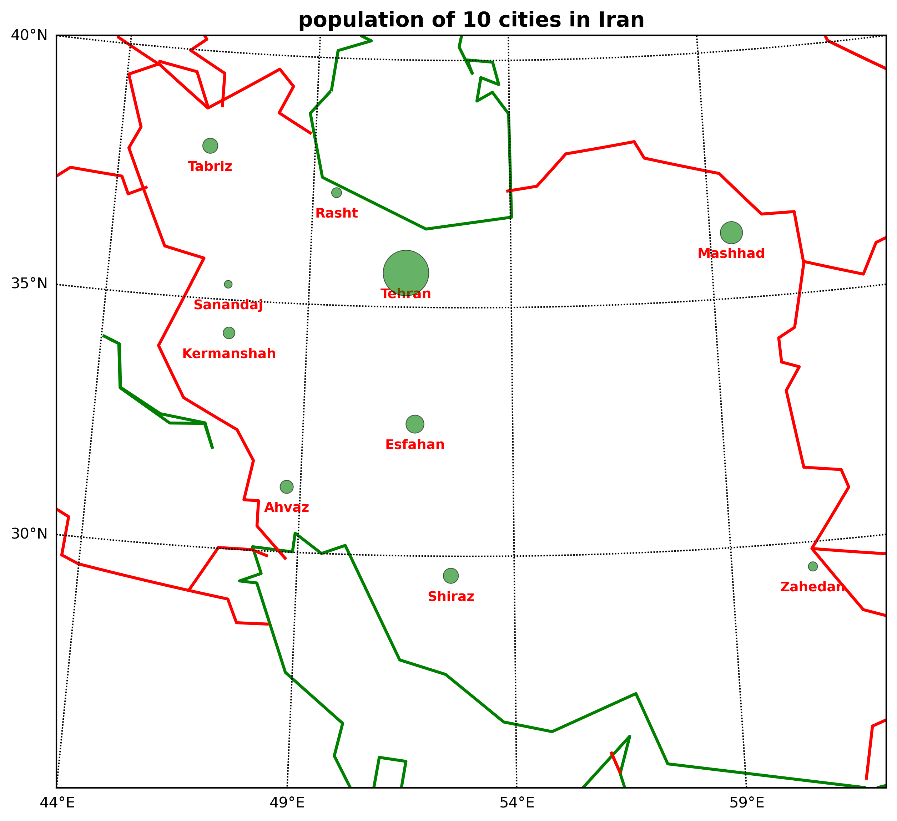

# Iran Cities Population Map
This project uses the pandas, matplotlib and Basemap libraries to
draw a map of Iran and visualize the 10 largest cities based on their
population using appropriately sized circles.

# Dataset
The "ir.csv" file includes the names of the cities, their geographical
coordinates and population data.

#Features
- Select 10 cities from the dataset
- Display them on the map
- Calculate the size of the circles based on the population

#Requirements
- Install the "pandas", "matplotlib" and "basemap" libraries
via Miniconda
- Place "ir.csv" and "iran.py" in the same folder
- Run "iran.py" in your python environment

# Example Output
You can view the cities of Iran in the "iran_map.png" file.

# Author
[BehzadPirouz](https://github.com/BehzadPirouz)
